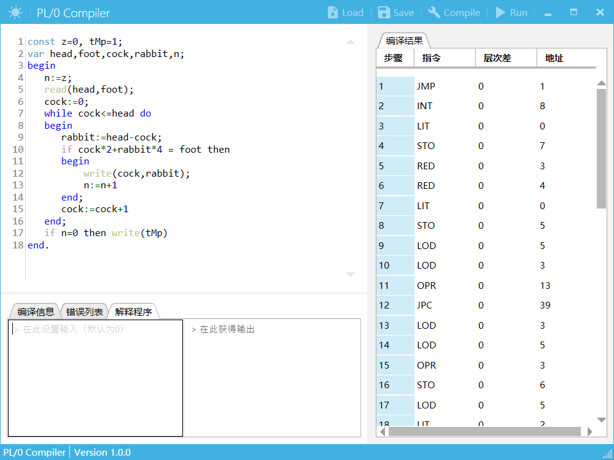

# PL/0编译系统

### 项目介绍

编译原理课程大作业，PL/0编译系统，主要功能为PL/0语言的编译运行。包括PL/0语言的词法分析、语法分析、语义分析、符号表管理、P-code生成、P-code解释器、错误处理这几个模块。有简洁友好的用户界面，支持文件读入和目标程序输出的功能。

> 使用语言：C#
> 
> 使用框架：.NET Framework 4.5
> 
> 目标平台：Windows
> 
> 使用开源控件库：
> 
> MahApps.Metro
> 
> MahApps.Metro.IconPacks
> 
> ICsharpCode.AvalonEdit
> 
> Dragablz
> 
> ControlzEX

软件界面：



### PL/0介绍

PL/0语言文法的扩充BNF表示如下：

```
<程序> ::= <分程序>.
<分程序> ::= [<常量说明部分>][变量说明部分>][<过程说明部分>]<语句>
<常量说明部分> ::= const<常量定义>{,<常量定义>};
<常量定义> ::= <标识符>=<无符号整数>
<无符号整数> ::= <数字>{<数字>}
<标识符> ::= <字母>{<字母>|<数字>}
<变量说明部分>::= var<标识符>{,<标识符>};
<过程说明部分> ::= <过程首部><分程序>;{<过程说明部分>}
<过程首部> ::= procedure<标识符>;
<语句> ::= <赋值语句>|<条件语句>|<当型循环语句>|<过程调用语句>|<读语句>|<写语句>|<复合语句>|<重复语句>|<空>
<赋值语句> ::= <标识符>:=<表达式>
<表达式> ::= [+|-]<项>{<加法运算符><项>}
<项> ::= <因子>{<乘法运算符><因子>}
<因子> ::= <标识符>|<无符号整数>|'('<表达式>')'
<加法运算符> ::= +|-
<乘法运算符> ::= *|/
<条件> ::= <表达式><关系运算符><表达式>|odd<表达式>
<关系运算符> ::= =|<>|<|<=|>|>=
<条件语句> ::= if<条件>then<语句>[else<语句>]
<当型循环语句> ::= while<条件>do<语句>
<过程调用语句> ::= call<标识符>
<复合语句> ::= begin<语句>{;<语句>}end
<重复语句> ::= repeat<语句>{;<语句>}until<条件>
<读语句> ::= read'('<标识符>{,<标识符>}')'
<写语句> ::= write'('<标识符>{,<标识符>}')'
<字母> ::= a|b|...|X|Y|Z
<数字> ::= 0|1|2|...|8|9
```
